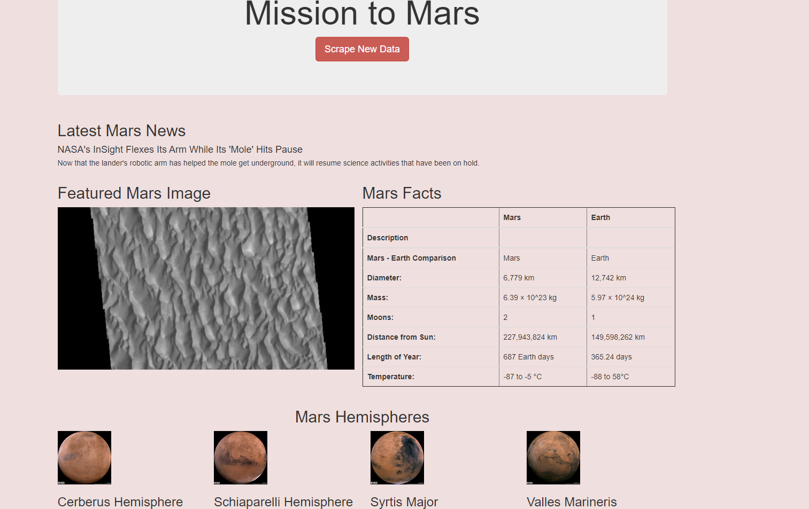
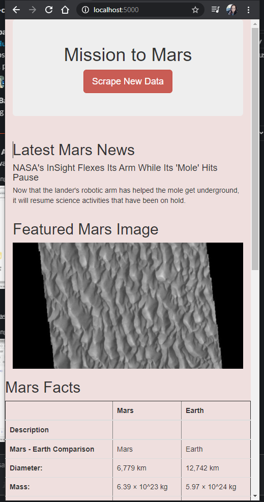
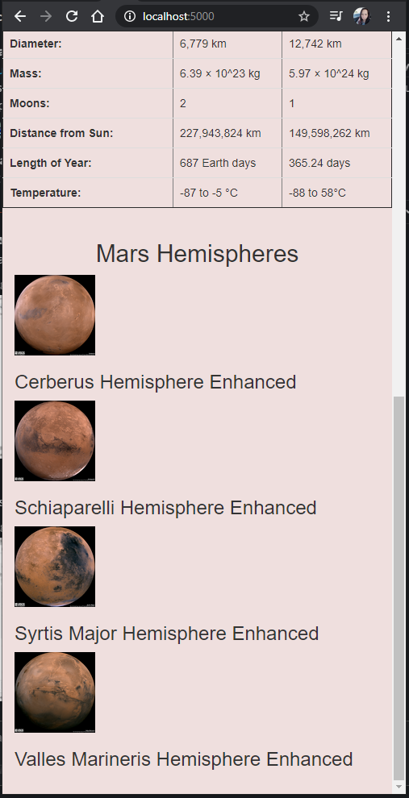

# Mission-to-Mars

The purpose of this project is to build up skills on web scraping methods. Every webpage is built using HTML. 

Robin wanted to create a page where she can scrap all the data, she would like the information on without visiting different sites every time we automated a web browser to visit different websites and extract data that is needed.

The process included:

•	BeautifulSoup and Splinter to scrape full-resolution images of Mars’s hemispheres and the titles of those images.
•	Store the scraped data on a Mongo database.
•	Utilizing a web application to display the data.
•	Alter the design of the web app to accommodate these images.
•	Use bootstrap to make the data appear appealing and to make sure the data is mobile friendly.

 
 
 
